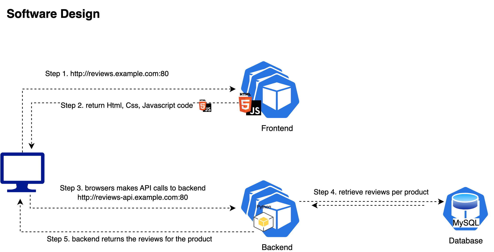
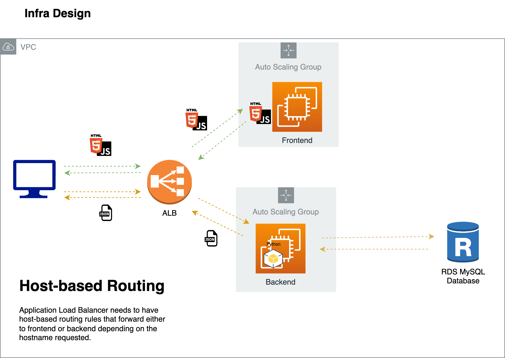

# 3-Tier Application: Product Review System

## Overview
This repository contains a 3-tier web application, the Product Review System, where users can add products and leave reviews. The 3-tier architecture comprises a frontend, backend, and a database. The application is designed to run on AWS infrastructure with high availability and scalability in mind.

- The Frontend application provides a user interface built with HTML, CSS, and JavaScript, served by an Nginx server. 

- The Backend is a RESTful API built with Python and Flask, which processes requests, performs operations, and interfaces with a MySQL database.

- The MySQL Database stores product and review data.

For more details about each component, refer to the README files in their respective directories:

- [Frontend](./frontend/README.md)
- [Backend](./api-backend/README.md)

## Important Note
Since our frontend just hosts static webpages, it relies on client-side browser processing with Javascript. Therefore requests to the backend come from the user directly (browsers calls the APIs to backend), which means that backend DNS name also needs to be publicly accessible.

Flow of the request is `Client => Frontend => Client => Backend => Database`

## Diagrams

**Software Design Overview**

**Infrastructure Design Overview**

## Helpful Resources on Learning to work with Git:

Naming Conventions:

- Best practices for file and branch naming: **https://namingconvention.org/git/**

Git/GitHub Fundamentals:

- Official Git documentation: **https://git-scm.com/doc**

Pull Requests (PRs):
- GitHub Pull Request documentation: **https://docs.github.com/en/pull-requests**

